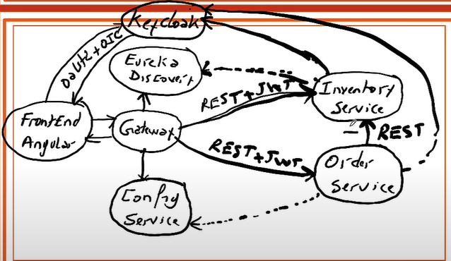
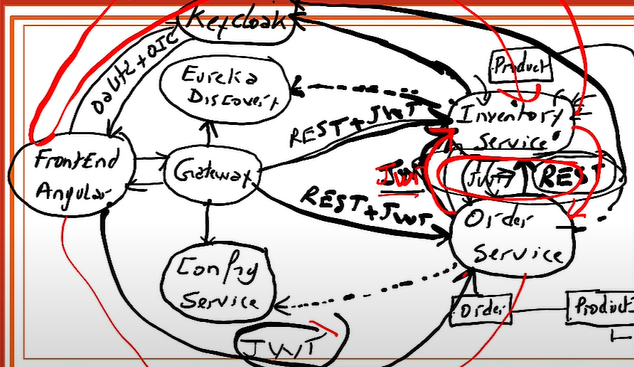

# ecom-backend-keycloak

This repository demonstrates how to interact with Keycloak for authentication and token management in an e-commerce backend application. Below are the examples for obtaining an access token using different flows.

---


## Global architecture


## Communication between microservices
- When using openfeign, to communicate between microservices we need to use an ``interceptor`` to add the token to the request header.
 

## 1. Get Access Token Using Resource Owner Password Credentials Grant
Use this method to get an access token by providing a username and password.

### Request:
**POST** `http://localhost:8080/realms/ecom-realm/protocol/openid-connect/token`  
**Headers:**
- `Content-Type: application/x-www-form-urlencoded`

**Body:**
```plaintext
grant_type=password&client_id=ecom-front&username=user1&password=1234
```

---

## 2. Get Access Token Using Refresh Token
Use this method to refresh your access token when the current one is close to expiry.

### Request:
**POST** `http://localhost:8080/realms/ecom-realm/protocol/openid-connect/token`  
**Headers:**
- `Content-Type: application/x-www-form-urlencoded`

**Body:**
```plaintext
grant_type=refresh_token&client_id=ecom-front&refresh_token=<YOUR_REFRESH_TOKEN>
```

Replace `<YOUR_REFRESH_TOKEN>` with your actual refresh token.

---

## 3. Get Access Token Using Client Credentials Grant
This method is used when the client authenticates using its credentials (no end-user required). Ensure the **Client Credentials** flow is enabled in Keycloak.

### Request:
**POST** `http://localhost:8080/realms/ecom-realm/protocol/openid-connect/token`  
**Headers:**
- `Content-Type: application/x-www-form-urlencoded`

**Body:**
```plaintext
grant_type=client_credentials&client_id=ecom-front&client_secret=<YOUR_CLIENT_SECRET>
```

Replace `<YOUR_CLIENT_SECRET>` with your actual client secret.

---

## Notes:
1. Replace `http://localhost:8080` with the actual Keycloak server URL in production.
2. Secure sensitive information such as `client_secret` and tokens to avoid exposure.

For more information about Keycloak configuration and token flows, refer to the [Keycloak Documentation](https://www.keycloak.org/documentation).

